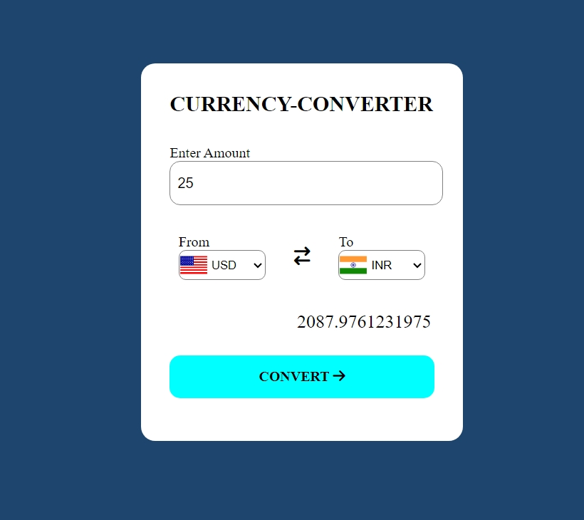

# Currency Converter
-Welcome to our currency conversion tool! This application allows you to convert between different currencies using real-time exchange rates, all within your web browser.

# WITH BETTER AND WORKING API'S

# Key Features
1.Seamlessly convert currencies with up-to-date exchange rates.
 
2.User-friendly interface with intuitive input fields and dropdown menus.
 
3.Powered by HTML, CSS, and JavaScript for a smooth and responsive experience.

# Technology Used.
1.HTML for structured and content.
 
2.CSS for styling and layout.
 
3.JavaScript for dyna,ic functionality and API integration.

# API INFORMATIONS
Our currency conversion tool integrates with the "Freecurrency API" to fetch real-time and accurate exchange rate data.
 
1.Flag image API :
 
 https://flagsapi.com/US/flat/64.png
  
2.CURRENCY CONVERTER API:
 
--To use this api visit https://api.freecurrencyapi.com/
 
  -- Create your free account.
   
  --You'll be directed to the dashboard.
   
  --Below dashboard there option named request playground.
   
  --Click and copy the url with the access key.
 
  Note:Do not use the currency converter api which is used in this code it will not work generate your own . Instrution are above.

# How to Contribute.
We welcome contributions to enhance and improve our currency conversion tool! To contribute, fork the repository and submit a pull request.

## ScreenShots of Currency Converter

# Deployment
Provide instructions on how to deploy the project to a live server.
